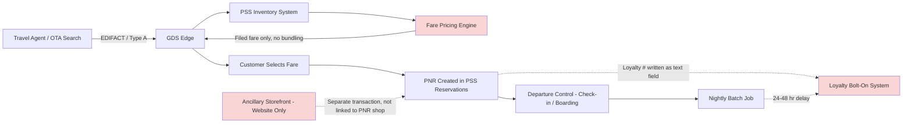

# As-Is Business Architecture

## Overview

Halvern Air's current retailing and distribution business architecture is organized around **filed fare distribution** — a model in which fares are pre-computed, filed with a fare-distribution clearinghouse, and made available to channels as static, pre-priced fare classes. This section describes the as-is process for offer/shop-to-book, and the organizational and system boundaries that constrain it.

## Process Narrative

When a travel agent or OTA searches for availability, the request reaches Halvern's PSS through a GDS edge connection using legacy Type A/EDIFACT messaging. The PSS inventory system returns available fare classes and seat availability; pricing is computed by a separate fare-pricing engine that has no visibility into ancillary inventory, loyalty status, or any bundling logic — it returns a fare, full stop. If the customer wants a checked bag, seat selection, or an upgrade, that is a *separate* shopping and pricing transaction, often in a different channel entirely (Halvern's own website's ancillary storefront, unconnected to the GDS shopping flow). There is no mechanism to present these together as a single bundled offer at the point of initial search.

Once a fare class is selected, a booking is created directly in the PSS reservations system as a PNR (Passenger Name Record). Loyalty membership, if attached, is written to the PNR as a free-text or lightly structured field; the actual point accrual does not happen at booking — it happens in a nightly batch job that reads completed-flight data from departure control and posts point accruals to the separate loyalty system, typically with a 24-48 hour delay. Redemption works similarly in reverse: a customer wanting to redeem points for a flight must call the contact center or use a separate, batch-synchronized web flow, because the booking engine has no real-time visibility into current point balance.

Distribution to indirect channels (travel agencies, OTAs, GDSs) happens exclusively through the filed-fare / EDIFACT pathway. There is no NDC-conformant API today. Every new channel partner that has wanted deeper integration (richer content, direct ancillary merchandising) has required a custom, point-to-point integration project against the PSS — Halvern's architecture team has delivered five such integrations in the last four years, each taking an average of 7-9 months and each maintained independently, with no shared component reused between them.

## Organizational Boundaries

- **Revenue Management** owns fare filing and pricing rules but has no system-level ability to express dynamic, personalized, or bundled pricing — their tooling outputs static filed fares.
- **Distribution/Commercial** owns channel partner relationships but is dependent on IT for every new integration, with no self-service capability to onboard a new channel.
- **Loyalty & Customer** owns the loyalty program commercially but the technical system is a vendor-managed bolt-on with limited API surface and batch-only integration.
- **IT/PSS Operations** owns and operates the PSS estate, prioritizing stability over new capability delivery given the system's operational criticality.

## As-Is Process Flow

*Red-shaded nodes indicate the specific points of business capability failure this program addresses: no dynamic/bundled pricing, no real-time loyalty, and no unified ancillary offer.*

## Key Limitations Driving the Program

1. **No bundling at point of sale** — ancillaries are sold in a disconnected transaction, suppressing attach rate.
2. **No dynamic pricing** — filed fares cannot reflect real-time demand, competitor position, or personalization.
3. **Batch-only loyalty** — accrual/redemption latency makes real-time partner integrations (co-brand card, retail partners) infeasible.
4. **Linear integration cost growth** — each new channel is a bespoke project against PSS internals, with no shared offer layer to amortize the cost.
5. **No NDC conformance** — Halvern cannot meet distribution partners' stated NDC requirement on the current architecture at any reasonable cost or timeline.

*Fictional case study — see [README](../README.md) for full disclaimer.*
