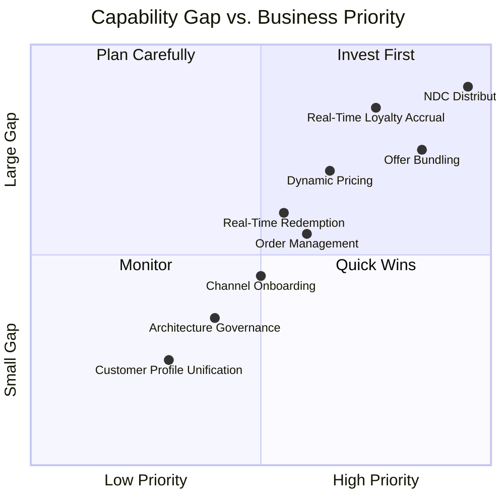

# Capability Map — Retailing & Distribution

Maturity is rated 1 (ad hoc/absent) to 5 (optimized, industry-leading), assessed by the ARB against comparable regional-carrier benchmarks during Phase B discovery workshops with Commercial, Loyalty, and IT stakeholders. Ratings are illustrative for this case study.

| Capability | As-Is Maturity | Target Maturity | Gap | Notes |
|---|---|---|---|---|
| Fare Filing & Static Pricing | 4 | 4 | 0 | Mature capability; not a program target — retained as-is, feeds the new dynamic pricing layer as a base fare input. |
| Dynamic / Personalized Pricing | 1 | 4 | 3 | No capability today beyond static filed fares; target introduces rules-based dynamic pricing hooks (not full pricing science — see vision-and-scope.md exclusions). |
| Offer Bundling / Ancillary Merchandising | 1 | 4 | 3 | Currently a disconnected transaction; target is single-offer bundling at point of sale. |
| NDC Distribution | 0 | 4 | 4 | No NDC capability exists today; this is the program's primary compliance driver. |
| GDS/EDIFACT Distribution (Legacy) | 4 | 3 (intentional) | -1 | Deliberately not increased — legacy channel is maintained, not enhanced, as volume shifts to NDC over time. |
| Channel Partner Onboarding | 2 | 4 | 2 | Currently bespoke per partner; target is largely self-service configuration. |
| Real-Time Loyalty Accrual | 1 | 5 | 4 | Batch-only today (24-48h); target is sub-5-second accrual, a genuine industry-leading target given Halvern's scale. |
| Real-Time Loyalty Redemption | 1 | 4 | 3 | Not available in the shopping flow today; target integrates redemption into offer construction. |
| Order Management (IATA ONE Order) | 0 | 3 | 3 | New capability; target maturity intentionally capped at 3 for program end — full Order-based check-in/interline is future scope. |
| PNR / Booking Management (PSS) | 4 | 4 | 0 | Retained as-is per Architecture Principle 1; PSS continues to do this well. |
| Customer Profile / Identity Management | 2 | 3 | 1 | Partially addressed as a byproduct of loyalty ledger work; full unification is future scope. |
| Payment / PCI Boundary | 3 | 4 | 1 | Incremental hardening as new components integrate with the existing tokenized boundary (Architecture Principle 7). |
| Architecture Governance (ARB, principles, ADRs) | 2 | 4 | 2 | Stood up specifically for this program in the Preliminary Phase; target is durable governance that outlives this program. |

## Capability Heat Map

The capability map directly informs Phase E prioritization (see 05-phase-e-opportunities-and-solutions/gap-analysis.md): NDC Distribution, Offer Bundling, and Real-Time Loyalty Accrual — the three largest gap/priority combinations — anchor Wave 1 and Wave 2 of the migration roadmap.

*Fictional case study — see [README](../README.md) for full disclaimer.*
