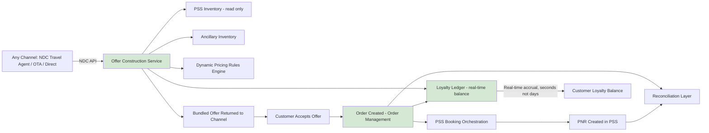

# To-Be Business Architecture

## Overview

The to-be business architecture introduces a **retailing capability** as a distinct business function, sitting logically between commercial pricing strategy and the systems that fulfill a booking. This is as much an organizational architecture change as a technical one: Revenue Management gains the ability to define bundling and dynamic pricing *rules* that a new offer construction capability executes in real time, and Distribution/Commercial gains a self-service channel onboarding path that no longer requires a bespoke IT project per partner.

## Process Narrative

A shopping request — from any channel, whether NDC-conformant travel agent, OTA, or Halvern's own direct channel — now reaches a single **offer construction capability** rather than going straight to PSS fare tables. This capability queries PSS inventory for base seat/fare availability (the PSS remains authoritative for that), but combines it with ancillary inventory, applicable dynamic pricing signals, and loyalty status (read in real time from the new loyalty ledger, described in 03-phase-c-information-systems-architecture/data-architecture.md) to construct a single, bundled, priced **Offer**. This is the same underlying capability regardless of which channel is asking — an NDC-conformant travel agent and Halvern's own website both consume the same offer construction service, just through different channel-specific API adapters.

When a customer accepts an offer, the retailing platform creates an **Order** — the IATA ONE Order-aligned commercial record — and orchestrates the underlying PSS booking creation (PNR) and any ancillary fulfillment records needed. Because the PSS remains system of record for the actual booking/ticketing state, a reconciliation process keeps the Order and the PNR in sync (see ADR-003 for the reconciliation architecture). Loyalty accrual is now triggered as part of order fulfillment, written to an event-sourced ledger, and reflected in the customer's available balance within seconds rather than days — enabling real-time redemption to be offered as part of the *same* shopping session, not a separate one.

New distribution partners onboard against a single, versioned NDC API rather than a bespoke integration — Revenue Management and Distribution/Commercial can now configure new channel access largely through platform configuration, cutting the typical onboarding timeline from 7-9 months to an estimated 6-10 weeks for a partner already NDC-capable on their end.

## Organizational Changes

- **Revenue Management** gains ownership of bundling and dynamic pricing *rules* (configured in the retailing platform) rather than only static fare filing — this is a genuine capability uplift requiring new skills (see 08-phase-h-change-management/change-management-plan.md).
- **Distribution/Commercial** gains a self-service partner onboarding capability, reducing dependency on bespoke IT delivery for each new channel.
- **Loyalty & Customer** gains real-time visibility and control over accrual/redemption rules via the ledger's rules engine, rather than depending on a vendor's batch cycle.
- **IT/PSS Operations** retains full ownership of PSS operations, now insulated from direct channel integration change by the offer construction layer sitting in front of it — reducing the frequency with which channel changes require PSS-side work.

## To-Be Process Flow

*Green-shaded nodes indicate the new business capabilities introduced by this program: offer construction, real-time loyalty, and order management.*

## What Stays the Same (Deliberately)

Departure control, check-in, and boarding processes are unchanged — the PSS continues to serve these functions, consistent with Architecture Principle 1 (PSS remains system of record). This is a deliberate scope boundary: modernizing check-in/boarding was evaluated and excluded (see vision-and-scope.md) because it does not block the NDC deadline or the ancillary revenue goal, and touching it would extend program risk into operationally critical, safety-adjacent systems for no commensurate business benefit in this phase.

*Fictional case study — see [README](../README.md) for full disclaimer.*
