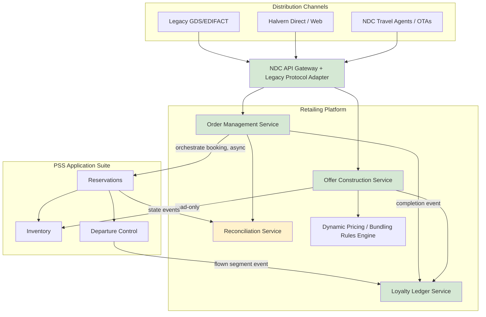

# Application Architecture

## As-Is Application Architecture

The as-is application landscape is dominated by the PSS suite — three loosely coupled applications (Reservations, Inventory, Departure Control) from a single legacy vendor stack, integrated to each other through the vendor's proprietary internal messaging rather than open APIs. Around this core sit a constellation of point solutions: a fare pricing engine, a separately hosted ancillary storefront (web-only, not integrated into the booking flow), a third-party loyalty bolt-on reached via a nightly batch file transfer, a contact center CRM with its own customer record, and five bespoke channel-integration services, each built for a single distribution partner and maintained independently by different teams with different code conventions. There is no API gateway, no shared integration platform, and no service that any two of these applications both depend on — every connection is genuinely point-to-point, which is the direct cause of the linear cost growth described in the as-is business architecture.

## To-Be Application Architecture

The to-be architecture introduces a **Retailing Platform** as a new application layer, positioned in front of the PSS, decomposed into four principal application components:

- **Offer Construction Service** — stateless, high-throughput service that assembles bundled, priced offers from PSS inventory, ancillary inventory, pricing rules, and loyalty status at shopping time.
- **Order Management Service** — owns Order lifecycle (create, amend, cancel) and orchestrates PSS booking creation; the primary consumer of the reconciliation service.
- **Loyalty Ledger Service** — event-sourced accrual/redemption engine with a real-time balance projection API.
- **Reconciliation Service** — the transitional component keeping Order and PNR state consistent during the dual-data-model period (see data-architecture.md, ADR-003).

A single **NDC API Gateway** fronts all channel-facing traffic, replacing the five bespoke channel integrations with one versioned, schema-conformant API surface that all current and future distribution partners consume identically. The gateway also fronts the existing GDS/EDIFACT channel via a protocol adapter, so legacy distribution continues without change to the partner-facing contract during the transition.

## Integration Pattern

Communication between the new retailing platform and the PSS is deliberately **API-mediated and asynchronous where it crosses the system-of-record boundary**, and synchronous only for read-only queries (Architecture Principle 5). This was a considered choice: an earlier design draft proposed direct database-level replication from the PSS for read performance, which the ARB rejected because it would couple the new platform's schema to the PSS vendor's internal (and undocumented, frequently changed) database structure — a direct violation of Architecture Principle 3 and a known failure pattern from Halvern's existing point-to-point integrations.

## To-Be Application Architecture Diagram

## Application Rationalization

The five bespoke channel-integration services are retired progressively as each distribution partner migrates onto the NDC API Gateway (see 06-phase-f-migration-planning/migration-roadmap.md); none are retired on day one, since Architecture Principle 5's eventual-consistency stance extends to the migration itself — partners cut over on their own readiness timeline, not Halvern's, and the gateway must run both old and new integration patterns concurrently for the duration of the migration.

The existing fare pricing engine is **not replaced** — it remains the source of base filed-fare pricing and is called by the Offer Construction Service as one input among several. This was a deliberate decision to avoid re-implementing a mature, regulator-scrutinized pricing calculation that carries its own certification history; only the *bundling and dynamic adjustment* layer on top of it is new.

*Fictional case study — see [README](../README.md) for full disclaimer.*
