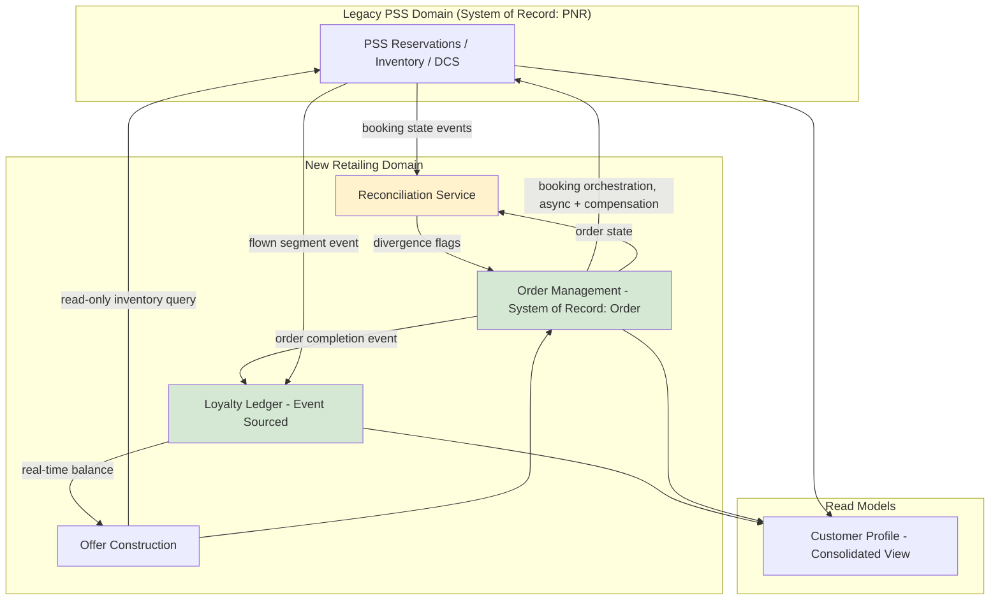

# Data Architecture

## As-Is Data Architecture

Halvern's data landscape is defined by fragmented ownership. The PNR (Passenger Name Record) is the closest thing to a central data entity today, owned by the PSS reservations system, but it is a semi-structured, largely text-based record designed for interline messaging in the 1990s — it was never intended to carry structured ancillary, bundling, or loyalty-transaction data, and every system that needs that information stuffs it into free-text remarks fields or maintains it separately with no reconciliation. Customer profile data is independently held in the PSS, the loyalty bolt-on, the contact center CRM, and the web storefront, with no single source of truth and no automated synchronization — a customer who updates their email address on the website has no guarantee it reflects in their loyalty profile. The loyalty ledger, such as it is, is a single mutable balance table: point transactions are not retained as discrete, auditable events, which makes dispute resolution and fraud investigation manual, slow processes today.

## To-Be Data Architecture

The to-be architecture introduces two new first-class data domains — **Offer** and **Order** — and a properly event-sourced **Loyalty Ledger**, each with a single designated owning system per Architecture Principle 11.

### Key Data Domains

| Domain | Owning System (To-Be) | Description |
|---|---|---|
| PNR / Booking | PSS Reservations (unchanged) | The confirmed booking and ticketing record; remains PSS system of record per Architecture Principle 1. |
| Offer | Retailing Platform | A priced, time-bound, bundled proposition constructed at shopping time; not persisted as commercial truth once expired/unaccepted. |
| Order | Retailing Platform (Order Management) | The IATA ONE Order-aligned confirmed commercial agreement; the new source of commercial truth, reconciled against but distinct from the PNR. |
| Loyalty Ledger | Loyalty Platform (new, real-time) | Append-only, event-sourced record of every accrual/redemption event; current balance is a derived projection (Architecture Principle 6). |
| Customer Profile | Customer Data Platform (new, thin — profile unification is partial in this program's scope) | Consolidated read model sourced from PSS, loyalty, and web; not yet the enforced system of record for all attributes — see capability-map.md, Customer Profile gap remains partially open at program end. |

### Integration Patterns

- **PSS to Retailing Platform (inventory read):** synchronous, read-only API calls for real-time seat/fare availability at shopping time — the PSS is queried, never written to, by the offer construction service.
- **Retailing Platform to PSS (booking orchestration):** the Order Management component issues a booking creation request to the PSS reservations API when an order is confirmed; this is asynchronous with a defined timeout and compensation path (Architecture Principle 5) — if PSS booking creation fails after order confirmation, a compensating cancellation/refund flow is triggered rather than leaving an orphaned order.
- **Order to PNR reconciliation:** a dedicated reconciliation service polls and event-listens for PSS booking state changes and reconciles them against Order state, flagging and queuing for manual review any divergence that automated reconciliation rules cannot resolve within a defined window (see ADR-003).
- **Order/Booking to Loyalty Ledger:** event-driven — a completed order (and, for point-driven accrual triggers like flown segments, a departure control completion event) publishes an event consumed by the loyalty ledger to append an accrual entry; redemption is a synchronous call from the retailing platform against the ledger's real-time balance projection at time of offer construction.

## Data Flow — To-Be

*Yellow-shaded node indicates the transitional reconciliation layer — a component that exists specifically to bridge the dual-data-model period and is expected to shrink in scope (not necessarily be removed entirely) as the PSS's role narrows over time; see ADR-003 and transition-architectures.md.*

## Data Governance Note

Because Order becomes the new system of record for commercial truth while PNR remains system of record for operational booking truth, the reconciliation service's divergence-handling rules are themselves an architecturally significant decision, not an implementation detail — they are documented and version-controlled as part of the Order Management architecture contract (see 07-phase-g-implementation-governance/architecture-contracts.md) rather than left to individual delivery teams to define ad hoc.

*Fictional case study — see [README](../README.md) for full disclaimer.*
