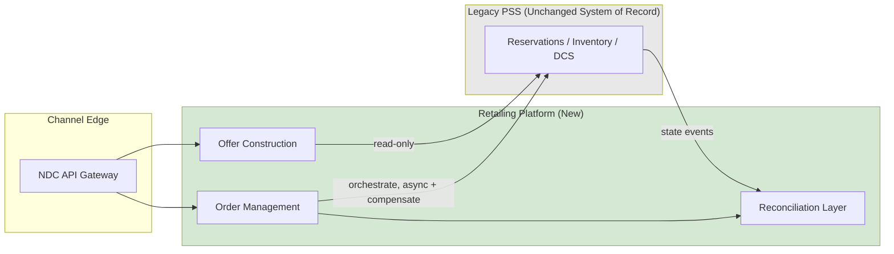

# Reference Architecture — Retailing Platform in Front of PSS

## Pattern Summary

This is the core technology pattern selected for the program: a **retailing platform positioned in front of an unreplaced legacy PSS**, owning offer construction and order management while the PSS remains system of record for booking, ticketing, and departure control. The pattern is not novel to the airline industry — it is a recognized response to the same NDC-adoption pressure faced by most legacy carriers — but it must be adapted to Halvern's specific scale and estate, which this document does.

## Pattern Diagram

## Applicability Conditions

This pattern is appropriate when **all** of the following hold:

1. The existing PSS is operationally stable and not itself a source of frequent incidents — introducing a new layer in front of an already-unreliable core compounds risk rather than isolating it.
2. The business driver is primarily **distribution and retailing capability**, not booking/inventory/departure-control functionality itself — the pattern only helps where the gap is in offer/order, not in the PSS's core functions.
3. There is organizational appetite and budget to run **two data models concurrently** for an extended transition period (typically 18-30 months at Halvern's scale) — this pattern trades a lower peak-risk cutover for a longer period of dual-model complexity.
4. The PSS vendor exposes (or can be made to expose, via a reasonably scoped integration effort) stable read APIs for inventory and a booking-creation API — if the PSS is a true black box with no API surface at all, this pattern cannot be implemented without an additional, separately scoped PSS integration-enablement project first.
5. Engineering capacity exists to build and operate a genuinely new, non-trivial platform (offer construction, order management, reconciliation) — this is new software, not configuration, and understaffing it is a common failure mode.

## When NOT to Use This Pattern

This pattern should be **rejected in favor of a full PSS replacement or a different approach** under the following conditions:

- **The PSS itself is the source of business pain.** If the core problem is reservations/inventory reliability, scalability, or an inability to support new fare/inventory constructs (e.g., continuous pricing, dynamic availability) rather than a distribution/offer gap, a retailing layer in front of it treats a symptom, not the cause. Halvern evaluated this and confirmed PSS core stability is acceptable (see ADR-001); a carrier without that baseline should not adopt this pattern.
- **The PSS vendor relationship or contract makes an additional integration layer commercially unviable** — e.g., per-transaction API fees so high that the offer construction service's read-heavy query pattern becomes cost-prohibitive at scale. This should be modeled explicitly before adopting the pattern, not discovered after build begins.
- **The organization cannot tolerate a multi-year dual-data-model period**, whether for regulatory reasons (e.g., a regulator requiring a single, auditable order record within a short deadline that a reconciliation layer cannot satisfy) or organizational capacity reasons (a team too small to operate two data models' worth of operational complexity, monitoring, and reconciliation exception handling).
- **The airline is below a scale where the platform's fixed operating cost is justified.** Per Architecture Principle 12, this pattern carries a meaningful fixed opex floor (platform licensing, dedicated run team — see business-case.md) that does not scale down proportionally; a very small carrier (for illustration, under roughly 1-2M passengers/year) is likely better served by a fully outsourced, vendor-hosted NDC distribution solution with no bespoke reconciliation layer at all.
- **A full PSS replacement is already planned or underway for other reasons** (e.g., end-of-life vendor support). Building a retailing layer in front of a PSS about to be replaced risks throwaway integration work; in that scenario, offer/order capability should be scoped as part of the replacement program directly.

## Anti-Patterns Explicitly Rejected

- **Direct database replication from PSS** — rejected due to undocumented, vendor-controlled schema coupling (see application-architecture.md).
- **NDC fields bolted directly onto the PNR** — rejected because it perpetuates the data model constraint this program exists to remove (Architecture Principle 2).
- **Synchronous, single-transaction consistency between Order and PNR** — rejected as infeasible given the PSS's transactional boundaries; would produce a brittle integration under load (Architecture Principle 5).

## Fit to Halvern's Scale

At ~9M passengers/year, Halvern sits comfortably above the threshold where this pattern's fixed operating cost is justified by transaction volume, but well below the scale of network carriers for whom multi-region, multi-PSS variants of this pattern are typical. The reference architecture adopted here is deliberately single-region, single-PSS-instance — a multi-region active-active retailing platform was considered and rejected as premature complexity for Halvern's current scale (Architecture Principle 12), with the explicit note that this decision should be revisited if passenger volume or geographic distribution grows materially.

*Fictional case study — see [README](../README.md) for full disclaimer.*
