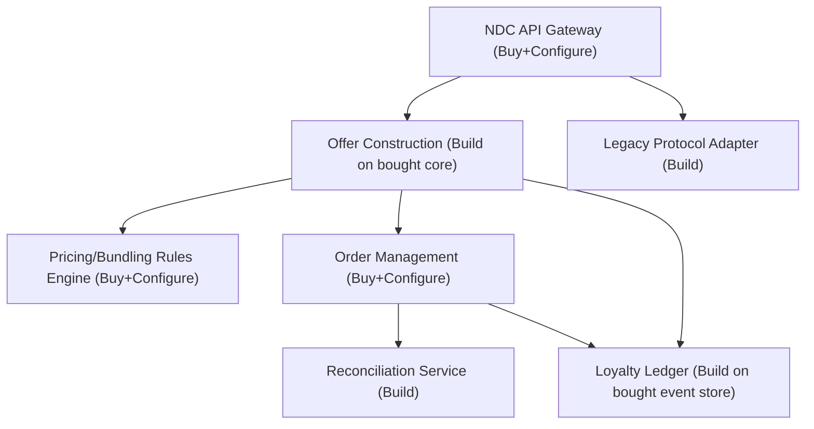

# Solution Building Blocks

## Purpose

This document decomposes the target architecture capabilities (capability-map.md) into discrete Solution Building Blocks (SBBs) — the buy/build/configure units that Phase F sequences into delivery waves. Each SBB is mapped to the Architecture Building Block (ABB) it realizes and marked buy, build, or configure per Architecture Principle 4.

## Solution Building Block Decomposition

| SBB | Realizes ABB | Buy/Build/Configure | Rationale |
|---|---|---|---|
| NDC API Gateway | Distribution channel edge, protocol translation | **Buy** (commercial API gateway product) + **Configure** (NDC schema mapping, legacy protocol adapter) | Undifferentiated infrastructure capability; buying avoids maintaining bespoke gateway software (Architecture Principle 4). |
| Offer Construction Service | Offer domain logic, bundling/pricing orchestration | **Build**, on top of a **bought** retailing platform core (see vendor-evaluation.md) | Bundling and pricing rules encode Halvern's commercial strategy — the point of competitive differentiation the buy-before-build principle reserves for custom work. |
| Order Management Service | Order domain, ONE Order-aligned lifecycle | **Buy** (retailing platform vendor's order management module) + **Configure** | Standard IATA-aligned order lifecycle; vendor products in this space are mature enough that custom build was not justified (see vendor-evaluation.md scoring). |
| Reconciliation Service | Order/PNR consistency during dual-model period | **Build** | Halvern-specific: reconciliation rules depend on Halvern's specific PSS vendor's data shapes and Halvern's chosen divergence-handling policy; no vendor product fits this transitional, PSS-specific need. |
| Loyalty Ledger Service | Real-time accrual/redemption, event sourcing | **Build**, core event-sourcing platform **bought** (managed event store) | The ledger's business rules (accrual formulas, redemption eligibility, fraud rules) are commercially differentiating; the underlying event-sourcing infrastructure is not. |
| Dynamic Pricing / Bundling Rules Engine | Rules configuration for Revenue Management | **Buy** (rules engine embedded in retailing platform) + **Configure** | Rules engines are a commodity technology; Halvern's differentiation is in the rules themselves (business configuration), not the engine. |
| Legacy Protocol Adapter | Backward-compatible GDS/EDIFACT distribution | **Build** (thin adapter) | No vendor product bridges Halvern's specific legacy EDIFACT implementation to the new gateway cleanly enough to justify a buy; scoped as a small, contained build. |
| Customer Profile Consolidated View | Partial profile unification | **Configure** (data virtualization/read-model layer within retailing platform) | Deliberately scoped as a read-only consolidated view, not a new profile system of record (see data-architecture.md), to stay within program scope boundaries. |

## Building Block Interaction

## Traceability to Gap Analysis

Each SBB above directly closes one or more gaps identified in gap-analysis.md; SBBs with no corresponding gap were deliberately excluded from this decomposition — for example, no SBB was defined for "full customer profile system of record," because that gap was explicitly deferred to future scope rather than addressed partially and poorly within this program's timeline.

## Sequencing Input to Phase F

The build-heavy SBBs (Reconciliation Service, Loyalty Ledger business logic, Legacy Protocol Adapter) carry the longest lead times and the highest Halvern-specific risk; they are sequenced earliest in the migration roadmap precisely because they cannot be de-risked by vendor selection alone; the buy-heavy SBBs (NDC API Gateway, Order Management core) are sequenced to follow vendor selection and contracting (vendor-evaluation.md), since their delivery risk is primarily a procurement and configuration risk rather than an engineering one.

*Fictional case study — see [README](../README.md) for full disclaimer.*
