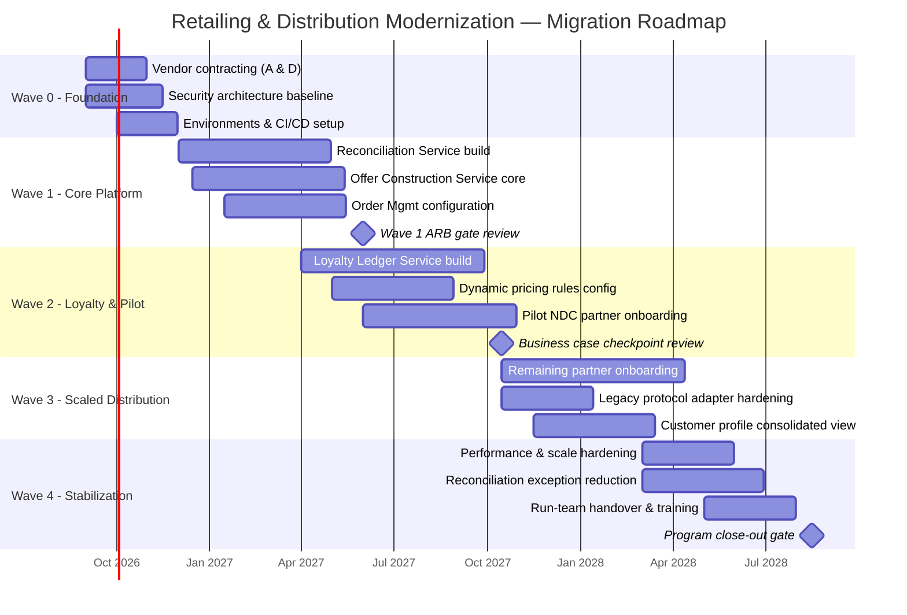

# Migration Roadmap

## Sequencing Rationale

The roadmap is organized into four waves over 24 months, sequenced by the priority and lead-time analysis in gap-analysis.md: the highest-risk, longest-lead-time, most Halvern-specific components (Reconciliation Service, core Offer Construction) start earliest, even though they will not be user-visible until later waves, because their build risk — not their business value — is the schedule-critical factor. Vendor-dependent components (Order Management, NDC Gateway configuration) are sequenced to follow vendor contracting, which itself follows the vendor-evaluation.md recommendation and Program Steering Committee approval.

An alternative sequencing was considered and rejected: front-loading the customer/partner-visible NDC Gateway capability first, to show early external progress against the deadline. This was rejected by the ARB because standing up channel-facing NDC connectivity before the Reconciliation Service exists would create a period where confirmed NDC orders have no mechanism to reconcile against PSS bookings — an unacceptable operational risk under Architecture Principle 5, even though it would have looked better on an external-facing status report.

## Wave Overview

| Wave | Duration | Primary Focus | Gate Criteria to Proceed |
|---|---|---|---|
| Wave 0 — Foundation | Months 1-3 | ARB/governance stood up (already complete), vendor contracting (Vendor A, Vendor D), environments, security architecture baseline | Vendor contracts signed; security architecture reviewed; ARB operating cadence established |
| Wave 1 — Core Platform Build | Months 3-9 | Reconciliation Service build, Offer Construction Service core, Order Management configuration, initial PSS integration | Reconciliation Service passes integration test against PSS staging; ARB go/no-go gate review |
| Wave 2 — Loyalty & Pilot Distribution | Months 8-15 | Loyalty Ledger Service build, first NDC-conformant pilot channel (single OTA partner), dynamic pricing rules engine configuration | Pilot partner completes NDC certification; real-time loyalty accrual live in pilot; business case checkpoint (ancillary attach-rate actuals review) |
| Wave 3 — Scaled Distribution | Months 14-20 | Remaining channel partner onboarding (NDC Gateway), legacy protocol adapter hardening, Customer Profile consolidated view | 70% of indirect-channel booking volume on NDC (per vision-and-scope.md success metric); no forced legacy channel outage recorded |
| Wave 4 — Stabilization & Optimization | Months 19-24 | Performance/scale hardening, reconciliation exception-rate reduction, handover to steady-state run team, Change Management adoption metrics review | 90% NDC adoption target met; reconciliation manual-exception rate below defined SLA; steady-state run team fully staffed and trained |

Waves overlap deliberately — Wave 2 begins before Wave 1 fully closes, since Loyalty Ledger build has no hard dependency on Offer Construction completion, only on the event backbone standard (technology-standards.md) being in place.

## Roadmap Gantt

## Risk Buffer

Each wave carries an implicit schedule buffer of approximately 10-15% not shown as separate line items in the Gantt above but reflected in the contingency capex line (business-case.md); this follows Halvern's standard capital program practice for initiatives with external dependency risk (vendor delivery, partner certification timelines) outside the program's direct control.

*Fictional case study — see [README](../README.md) for full disclaimer.*
