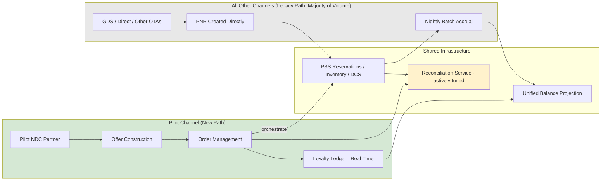

# Transition Architectures

## Why Named Transition States Matter

The as-is and to-be architectures (Phase B and Phase C) describe two end states, but a 24-month program spent entirely "in between" needs its own architecturally defined intermediate states — not just an implicit gradient from one to the other. Without a named transition state, delivery teams have no shared reference for what "correct" looks like at month 10 versus month 18, and the ARB has no fixed point to gate against. This document defines the **Transition State 1: Pilot Parallel Operation** architecture, which Halvern's roadmap holds for the duration of Wave 2 (see migration-roadmap.md).

## Transition State 1 — Pilot Parallel Operation (Wave 2, approx. Months 8-15)

### What Is True at This State

- The Reconciliation Service and Offer Construction Service core are live in production, but traffic is limited to a **single pilot NDC distribution partner** — not yet the full partner portfolio.
- The Loyalty Ledger Service is live and accruing/redeeming points in real time, but **only for bookings made through the pilot NDC channel**; all other channels (legacy GDS, direct web) continue posting loyalty accrual via the existing nightly batch process.
- Two loyalty data paths therefore run concurrently by design: real-time event-sourced accrual for the pilot channel, and legacy batch accrual for every other channel, converging into the same underlying balance projection. This dual-path state is intentionally accepted as necessary, not a defect — reconciliation logic between the two paths is itself a deliverable of this transition state, tested at pilot scale before Wave 3 exposes it to full volume.
- The vast majority of Halvern's booking volume (all non-pilot channels) continues to flow entirely through the legacy PSS path with no visibility into the new Order or Offer domains at all.
- Order Management exists and is populated only for pilot-channel bookings; the reconciliation service's divergence-handling rules are actively being tuned against real (if low-volume) production data rather than only synthetic test data.

### Why This Intermediate State Is Necessary

A direct jump from as-is to "all channels on NDC simultaneously" was evaluated and rejected (see ADR-001 and reference-architecture.md's rejection of big-bang approaches). Transition State 1 exists specifically to validate three things under real but contained risk before committing to full-scale rollout:

1. **Reconciliation logic correctness** — divergence-handling rules between Order and PNR are tuned against live production edge cases (irregular operations, schedule changes, partial cancellations) that synthetic test data does not fully anticipate.
2. **Real-time loyalty ledger operational behavior** — confirming sub-5-second accrual holds under real production load patterns, not just load-test simulation.
3. **Ancillary revenue uplift assumption** — the business case's largest and least certain line item (business-case.md) is validated against pilot-channel actuals before the Wave 2 gate release authorizes further capital.

### Explicit Exit Criteria From This State

Transition State 1 is exited — moving toward Wave 3's Transition State 2 (Scaled Parallel Operation, not detailed separately here but following the same reconciliation pattern at higher volume) — only when:

- Reconciliation manual-exception rate on pilot-channel volume is below the defined SLA threshold for two consecutive months.
- Loyalty ledger real-time accrual latency holds its sub-5-second target at pilot volume with no unresolved P1/P2 incidents in the prior 60 days.
- The ARB Wave 2 gate review (migration-roadmap.md) formally approves proceeding, informed by the business case checkpoint.

## Transition Architecture Diagram — State 1

*This diagram is specific to Transition State 1 and is explicitly not the to-be end state (compare to 02-phase-b-business-architecture/to-be-business-architecture.md and 03-phase-c-information-systems-architecture/data-architecture.md, where all channels flow through the new path and legacy batch accrual is fully retired).*

*Fictional case study — see [README](../README.md) for full disclaimer.*
